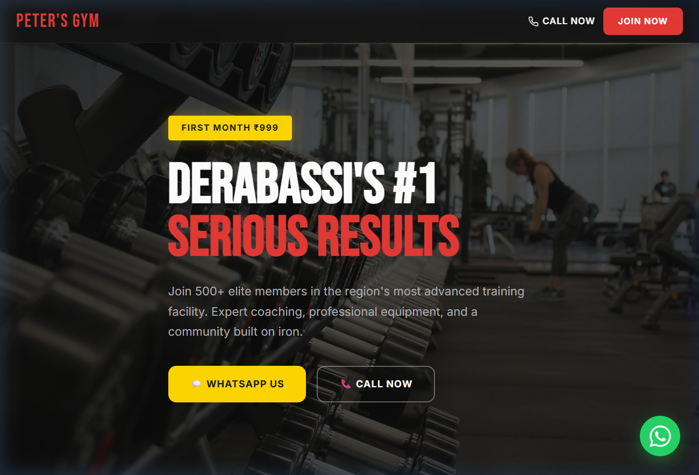

# 🏋️ Peter's Gym — Derabassi

A premium, dark-themed landing page for **Peter's Gym**, Derabassi's #1 serious training facility.



## 🔗 Live Preview

Open `index.html` in any browser — zero dependencies, no build step.

## ✨ Features

- **Single-file website** — all HTML, CSS & JS in one `index.html`
- **Dark theme** with red & gold accents
- **8 sections** — Hero, USPs, Transformations, Facilities, Pricing, Testimonials, Location, CTA
- **3-tier pricing** — Monthly ₹1,499 · Quarterly ₹3,999 · Annual ₹11,999
- **WhatsApp & Call CTAs** throughout
- **Google Maps** embed for directions
- **Sticky navbar** + floating WhatsApp button
- **Fully responsive** — mobile, tablet, desktop
- **Smooth scroll** navigation
- **CSS animations** on scroll (fade-in, slide-up)

## 🎨 Design Tokens

| Token | Value |
|-------|-------|
| Background | `#131313` |
| Card Surface | `#1C1B1B` |
| Primary Red | `#E53935` |
| CTA Gold | `#FFD600` |
| Headings | Bebas Neue |
| Body | Inter |

## 📁 Structure

```
PetersGym/
├── index.html      # Complete website
└── README.md       # This file
```

## 🛠️ Tech Stack

- Pure HTML5 + CSS3 + Vanilla JS
- Google Fonts (Bebas Neue, Inter)
- Google Maps Embed API
- No frameworks, no dependencies

## 📞 Contact

- **Location:** Ambala-Chandigarh Highway, Derabassi, Punjab
- **Hours:** Mon–Sat 5:30 AM – 10 PM · Sun 7 AM – 12 PM

---

Built with 💪 for Peter's Gym
